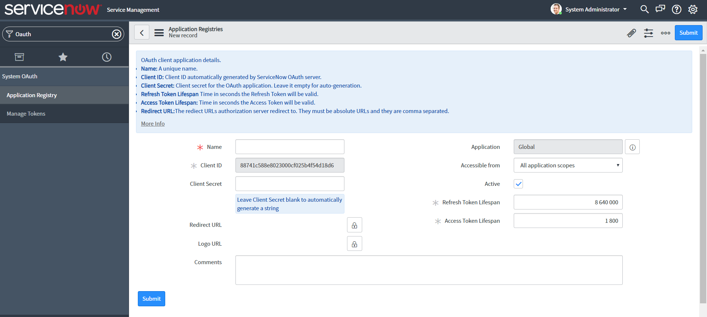
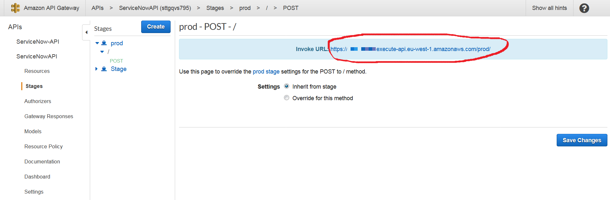
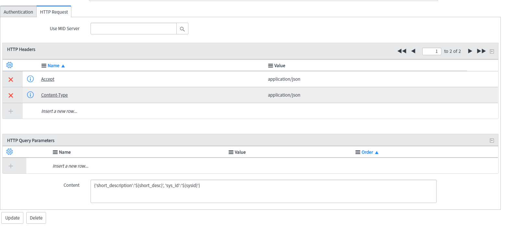
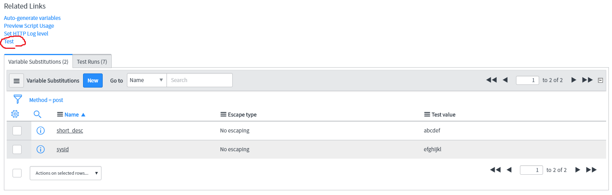
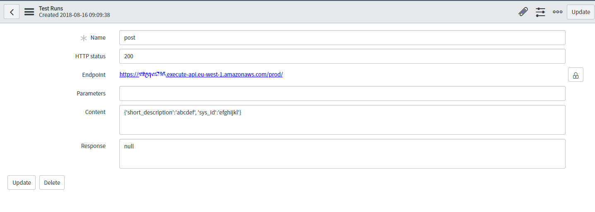
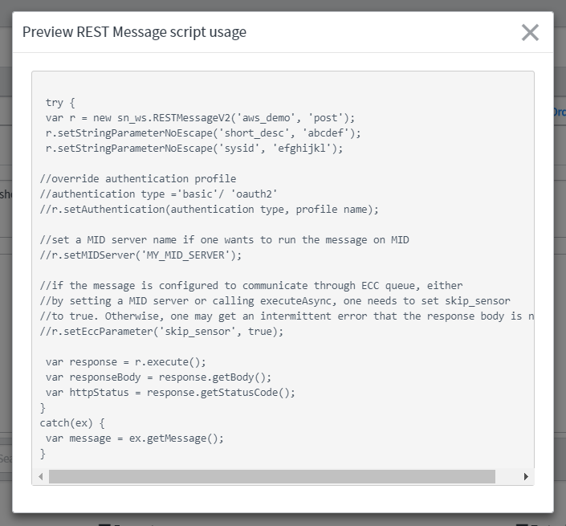
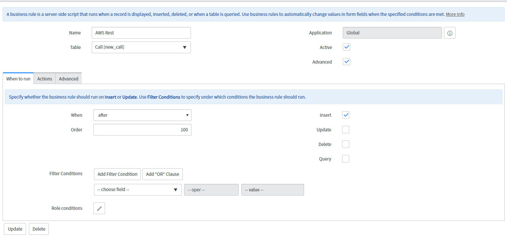
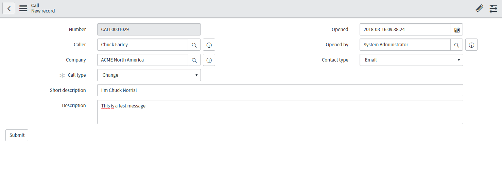
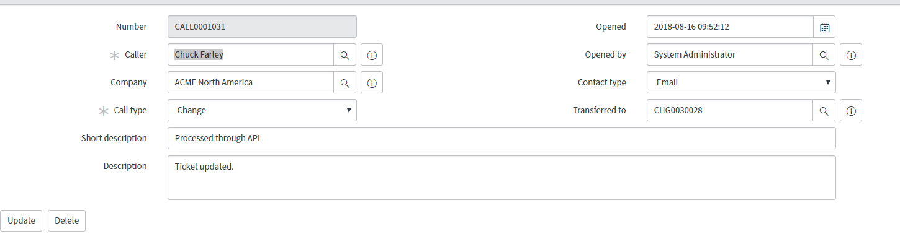

# README SNOW-AWS integration demo

A Cloudformation template targeting to deploy the AWS serverless backend to interact with ServiceNow for user provisioning, some configuration must be done on your ServiceNow instance in order to use this template. 

To resume how it works, when you create a new_call object in ServiceNow, it will trigger a Business Rules which will send an Outbound Rest Message to a lambda function through API Gateway.
This function gets two information from the ServiceNow new_call object: the short description and the sys_id  
The short description can be used to transmit data and the sys_id is used to retrieve the original message in order to update it with SNOW API.

More complex manipulations can be processed using the python pysnow library which is bundled with the lambda function, more information on the library is available [here](https://pysnow.readthedocs.io/en/latest/)

## Table of Contents

- [Installation](#installation)
- [Usage](#usage)
- [Improvement](#improvement)
- [Support](#support)

## Installation

**Version beta**: the template currently deploys one API gateway with a post method, two lambda functions, one in nodejs to authorize using the API only with the right credentials, one in python bundled with the pysnow library to process and update the request.  
The ServiceNow Configuration part must be done manually.

### ServiceNow pre-configurations

First, you need to install the `Service Desk Call` extension which allows creating a large panel of requests and ticket from the same object. To do so go on: `https://[num_instance].service-now.com/v_plugin_list.do` and install the required plugin from the list.

You now need to create a new basic authentication profile to connect to API Gateway, for doing so go on `https://[num_instance].service-now.com/sys_auth_profile_basic_list.do` and select New, call the user api-gateway and give it a login and password.

Now in order to allow your lambda function to make modifications to ServiceNow records through API, you should configure a new OAuth Client. In the Navigation panel search for `System OAuth>Application Registry` and select New, when pressed for a choice, choose `Create an OAuth API endpoint for external clients`, you should have a menu similar to the one below.



Name it AWS, let the Client Secret empty so ServiceNow will create it and press submit. Now select back your OAuth Client object and write down the Client ID and Client Secret, you will need them.  
Create a new ServiceNow User and give him the admin role so he can use the API.

### Launch the stack

The stack will ask you all the credentials configured above to interact with ServiceNow:

**APIPassword**: The password configured in the api-gateway authentication profile  
**APIUser**: The login configured in the api-gateway authentication profile  
**LambdaBackendBucket**: Bucket where are stored your zip files  
**LambdaBackendKey**: Path to the api.zip file  
**SNOWID:**: ClientID of the ServiceNow OAuth client configured above  
**SNOWInstance**: Name of your ServiceNow instance ( [num_instance] )  
**SNOWPassword**: Password of a ServiceNow API user  
**SNOWSecret**: Client Secret of the ServiceNow OAuth client configured above  
**SNOWUser**: Name of a ServiceNow API user  

### ServiceNow configuration

In the stack created resources, select the new API Gateway called ServiceNowAPI and copy the invoke URL of the POST method in the prod stage:



Back in ServiceNow, create a new Rest Message: `System Web Services > Outbound > REST Message`
Call it AWS and paste the endpoint copied above in the Endpoint field.
In the Authentication field, choose Basic and select the Basic auth profile created earlier.
Now create a New HTTP Method and call it post, select POST as HTTP method and past the previous API Gateway endpoint.  
For authentication, select Inherit from parent and in HTTP Request, copy the HTTP Headers and HTTP Query Parameters from the screenshot below.



We pass some json parameters in the body of our request and will fill them with values of our newly created ticket to trigger the lambda in AWS.  
Now create two new Variable Substitutions called short_desc and sysid and give them some test values, then select Test and you should have the same results as below with an HTTP status 200.

 

Above the test link, select now Preview Script Usage and copy the shown script, you will need it soon.



Now in `System Definition > Business Rules` create a new Business Rule, name it for instance AWS Rest and for table new_call, then tick the Advanced box and complete the `When to run setting as shown below`, you can optionally add a filter condition, for example not to trigger the rule for specific users or group of users.



Finally, in the Advanced tab, past the previously copied script in the body of the function but override our test values with the value of our newly created object:

```javascript
r.setStringParameterNoEscape('short_desc', current.short_description);
r.setStringParameterNoEscape('sysid', current.sys_id);
```

We're now ready for prime-time!

## Usage

Let's create a change request in Service `Desk > Calls > New Call` with some test values.



If you open back the request in `Desk > Calls > All Open Calls`, you will see that the lambda function has updated it.



## Improvement

The nodejs function for Basic Auth is pretty simple and could be deployed easily inline. However, the InlineCode hasn't been merged yet in the master branch of the AWS SAM project [currently in develop only](https://github.com/awslabs/serverless-application-model/pull/447#issuecomment-413483722)

Once it will be done, I recommend to modify this part of the template:

```yaml
  AuthorizerLambda:
    Type: 'AWS::Serverless::Function'
    Properties:
      Handler: authorizer.handler
      Runtime: nodejs6.10
      CodeUri:
        Bucket: !Ref LambdaBackendBucket
        Key: authorizer.zip
```

By:

```yaml
  AuthorizerLambda:
    Type: 'AWS::Serverless::Function'
    Properties:
      Handler: authorizer.handler
      Runtime: nodejs6.10
      InlineCode: !Join
        - "\n"
        - - '"use strict";' 
          -  const AWS = require('aws-sdk');
          -  const login = process.env['LOGIN'];
          -  const pswd = process.env['PASWD'];
          -  exports.handler = function (event, context, callback) {
          -   var authorizationHeader = event.headers.Authorization;
          -
          -   if (!authorizationHeader) return callback('Unauthorized');
          -
          -   var encodedCreds = authorizationHeader.split(' ')[1];
          -   var plainCreds = (new Buffer(encodedCreds, 'base64')).toString().split(':');
          -   var username = plainCreds[0];
          -   var password = plainCreds[1];
          -
          -   if (!(username === login && password === pswd)) return callback ('Unauthorized');
          -
          -   var authResponse = buildAllowAllPolicy(event, username);
          -
          -   callback(null, authResponse);
          - "};"
          - function buildAllowAllPolicy (event, principalId) {
          -   var tmp = event.methodArn.split(':');
          -   var apiGatewayArnTmp = tmp[5].split('/');
          -   var awsAccountId = tmp[4];
          -   var awsRegion = tmp[3];
          -   var restApiId = apiGatewayArnTmp[0];
          -   var stage = apiGatewayArnTmp[1];
          -   var apiArn = 'arn:aws:execute-api:' + awsRegion + ':' + awsAccountId + ':' +
          -     restApiId + '/' + stage + '/*/*';
          -   const policy = {
          -     "principalId: principalId,"
          -     "policyDocument: {"
          -       "Version: '2012-10-17',"
          -       "Statement: ["
          -         "{"
          -           "Action: 'execute-api:Invoke',"
          -           "Effect: 'Allow',"
          -           "Resource: [apiArn]"
          -         "}"
          -       "]"
          -     "}"
          -   "};"
          -   return policy;
          - "}"
```
This would allow not to mess up more with S3 bucket location for this small function. 
 
## Support

In case of bug open an issue on the [github repository](https://github.com/Kharkovlanok/snow-aws-integration/issues) or send me an [email](mailto:webmaster@aristidebouix.cloud) for support.

